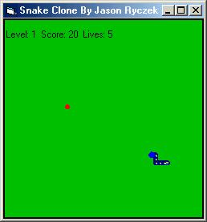

<div align="center">

## Snake / Nibble Clone \- Version 1\.00


</div>

### Description

This is a snake / nibble clone that I made as some use of free time. It's one of my first games. I think I've fixed most all the bugs, but if you find any please let me know! Oh, and as far as I know, this only works for VB 5.0 and VB 6.0, I haven't tried any other versions...
 
### More Info
 
The user doesn't need to know much, just that you use the arrow keys, and that the form needs a timer.


<span>             |<span>
---                |---
**Submitted On**   |
**By**             |[Jason Ryczek](https://github.com/Planet-Source-Code/PSCIndex/blob/master/ByAuthor/jason-ryczek.md)
**Level**          |Beginner
**User Rating**    |4.0 (16 globes from 4 users)
**Compatibility**  |VB 5\.0, VB 6\.0
**Category**       |[Games](https://github.com/Planet-Source-Code/PSCIndex/blob/master/ByCategory/games__1-38.md)
**World**          |[Visual Basic](https://github.com/Planet-Source-Code/PSCIndex/blob/master/ByWorld/visual-basic.md)
**Archive File**   |[](https://github.com/Planet-Source-Code/jason-ryczek-snake-nibble-clone-version-1-00__1-14272/archive/master.zip)


### Source Code

```
'***********************************************
'*This needs a Timer named Timer1 to work   *
'*Form Borderstyle needs to be 1 - Fixed Single*
'***********************************************
'-This is a game like snake or nibble
'If you have any found bugs, please email me
'jswyft@aol.com
'You only need to add a timer, and this game
'should work fine!
Dim x(0 To 1000) As Long, y(0 To 1000) As Long '-11 body pieces
Dim xHead As Long, yHead As Long '-the head coordinates
Dim xspeed As Long, yspeed As Long '-speed of snake
Dim fx As Long, fy As Long '-Food coordinates
Dim Length As Long '-length of body
Dim Level As Long '-level of play
Dim Points As Long '-score
Dim Lives As Long '-Number of Tries
Private Sub Form_Load()
Me.Caption = "Snake Clone By Jason Ryczek"
Me.Height = 4155
Me.Width = 3870
'-This Project needs a timer
Timer1.Interval = 250 'set at different intervals for different speeds
'-Set these to form when it loads
Me.AutoRedraw = True
Me.ClipControls = False
Me.ScaleMode = 3
Me.BackColor = &HC000&
New_Game
End Sub
Private Sub Form_KeyDown(KeyCode As Integer, Shift As Integer)
'-This is how you move using the keyboard
Select Case KeyCode
  Case vbKeyUp '-key up
  If yspeed = 0 Then
    xspeed = 0
    yspeed = -5
  End If
  Case vbKeyDown '-key down
  If yspeed = 0 Then
    xspeed = 0
    yspeed = 5
  End If
  Case vbKeyRight '-key right
  If xspeed = 0 Then
    xspeed = 5
    yspeed = 0
  End If
  Case vbKeyLeft 'key left
  If xspeed = 0 Then
    xspeed = -5
    yspeed = 0
  End If
  Case vbKeyP '-This is for pausing
    If Timer1.Enabled = True Then
      Timer1.Enabled = False '-pause on
    Else
      Timer1.Enabled = True '-pause off
    End If
  Case vbKeyN
    New_Game
End Select
End Sub
Private Sub Timer1_Timer()
xHead = xHead + xspeed
yHead = yHead + yspeed
BodyCycle
Me.Cls
Boarder
BodyHeadHit Length
Me.Print ""
Me.Print "  Level: " & Level & " Score: " & Points & " Lives: " & Lives
DrawSnake Length
Me.DrawWidth = 4
Me.Circle (fx, fy), 1, vbRed
If (xHead = fx) And (yHead = fy) Then
  Length = Length + 1
  DrawFood
  Points = Points + 10
End If
If (Length / Level) = 10 Then
  Level = Level + 1
End If
End Sub
Sub BodyCycle()
Dim counter As Integer
For counter = 1000 To 1 Step -1
  x(counter) = x(counter - 1)
  y(counter) = y(counter - 1)
  x(0) = xHead: y(0) = yHead
Next counter
End Sub
Sub DrawSnake(ByVal Snake_Length As Long)
Dim a As Integer
For a = 1 To Snake_Length
  Me.DrawWidth = 6
  Me.Line (xHead, yHead)-(x(0), y(0))
  Me.Line (x(a - 1), y(a - 1))-(x(a), y(a)), QBColor(1)
  Me.DrawWidth = 1
  Me.Line (x(a - 1) + 1, y(a - 1) + 1)-(x(a) + 1, y(a) + 1), vbCyan
  Me.Line (x(a - 1), y(a - 1))-(x(a) + 1, y(a) - 1), vbYellow
  Me.DrawWidth = 4
  Me.Circle (xHead, yHead), 2, vbBlue
Next a
End Sub
Sub New_Game()
Lives = 5
Timer1.Enabled = True
DrawFood
Dim a As Integer
For a = 0 To 1000
  x(a) = Me.ScaleWidth / 2
  y(a) = Me.ScaleWidth
  xHead = Me.ScaleWidth / 2
  yHead = Me.ScaleWidth - 5
  xspeed = 0
  yspeed = -5
Next a
Points = 0
Length = 5
Level = 1
End Sub
Sub New_Start()
Timer1.Enabled = True
DrawFood
Dim a As Integer
For a = 0 To 1000
  x(a) = Me.ScaleWidth / 2
  y(a) = Me.ScaleWidth
  xHead = Me.ScaleWidth / 2
  yHead = Me.ScaleWidth - 5
  xspeed = 0
  yspeed = -5
Next a
End Sub
Sub Levels(ByVal Level_Number As Long)
Dim PlayAgain As String '-this is to play again if you win
Select Case Level_Number
  Case 1
    Timer1.Interval = 250
    Points = Points + 50
  Case 2
    Timer1.Interval = 225
    Points = Points + 50
  Case 3
    Timer1.Interval = 200
    Points = Points + 50
  Case 4
    Timer1.Interval = 175
    Points = Points + 50
  Case 5
    Timer1.Interval = 150
    Points = Points + 50
  Case 6
    Timer1.Interval = 125
    Points = Points + 50
  Case 7
    Timer1.Interval = 100
    Points = Points + 50
  Case 8
    Timer1.Interval = 75
    Points = Points + 50
  Case 9
    Timer1.Interval = 50
    Points = Points + 50
  Case 10
    Timer1.Interval = 25
    Points = Points + 50
  Case 11
    Timer1.Interval = 20
    Points = Points + 50
  Case 12
    Timer1.Interval = 15
    Points = Points + 50
  Case 13
    Timer1.Interval = 10
    Points = Points + 50
  Case 14
    Timer1.Interval = 5
    Points = Points + 50
  Case 15
    Timer1.Interval = 1
    Points = Points + 50
  Case 16
    Timer1.Enabled = False
    Points = Points + 500
    MsgBox "You Won!!!"
End Select
End Sub
Sub DrawFood()
Dim x As Long, y As Long
'-This gives 50 squared possible positions all Randomly placed
Randomize Timer
x = Round((Rnd * 48), 1) + 1
y = Round((Rnd * 48), 1) + 1
'-This spreads it out to scale
fx = x * 5
fy = y * 5
End Sub
Sub BodyHeadHit(ByVal Snake_Length As Long)
Dim a As Integer
For a = 2 To Snake_Length Step 1
  If (xHead = x(a)) And (yHead = y(a)) Then
    If Lives > 0 Then
      Lives = Lives - 1
      New_Start
    Else
      Timer1.Enabled = False
      MsgBox "You Died!"
      New_Game
    End If
  End If
Next a
End Sub
Sub Boarder()
Me.Line (0, 0)-(0, Me.ScaleWidth), vbBlack
Me.Line (0, 0)-(Me.ScaleHeight, 0), vbBlack
Me.Line (Me.ScaleWidth, Me.ScaleHeight)-(0, Me.ScaleWidth), vbBlack
Me.Line (Me.ScaleWidth, Me.ScaleHeight)-(Me.ScaleHeight, 0), vbBlack
If (xHead < 0) Or (xHead > Me.ScaleWidth) Or (yHead < 0) Or (yHead > Me.ScaleHeight) Then
  If Lives > 0 Then
    Lives = Lives - 1
    New_Start
  Else
    Timer1.Enabled = False
    MsgBox "You Died!"
    New_Game
End If
End If
End Sub
```

